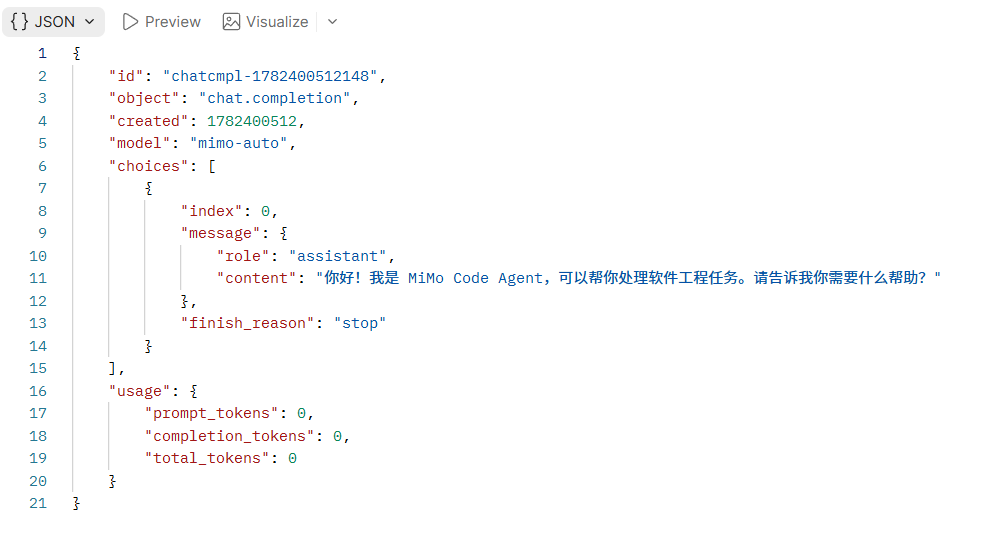
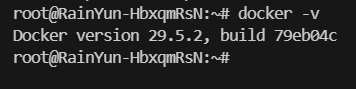
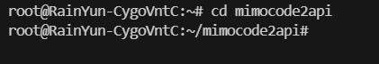
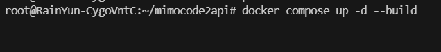
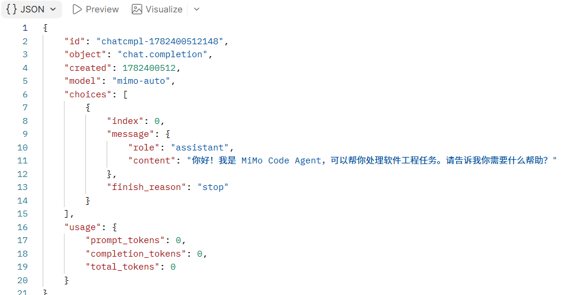

<div align="center">

# MiMoCode2API 反代教程

**把 MiMoCode 里的免费模型，通过 Docker 一键反代成 OpenAI 兼容 API**


</div>

---

## 一、项目简介

> MiMoCode 里面有免费模型，但是没有提供 API。我们通过 **反向代理** 的方式，将网页端能力封装成 **OpenAI 兼容的 `/v1/chat/completions` 接口**，方便接入任何支持 OpenAI 协议的客户端（如 NextChat、ChatBox、LobeChat、Cursor 等）。

- **项目地址**：[github.com/Sliverkiss/mimocode2api](https://github.com/Sliverkiss/mimocode2api)
- **部署方式**：推荐使用 **Linux + Docker** 部署，国内无法直连 GitHub 的用户可使用加速或代理



---

## 二、目录

| 章节 | 内容 |
| --- | --- |
| [服务器选购](#三服务器选购) | 推荐配置与购买地址 |
| [安装 Docker](#1-安装-dockerubuntu-2404) | 步骤 ①：安装 Docker |
| [拉取项目](#2-拉取项目) | 步骤 ②：克隆仓库 |
| [启动服务](#3-启动服务) | 步骤 ③：Docker Compose 部署 |
| [调用验证](#4-调用验证) | 步骤 ④：curl 测试 |
| [接口信息](#五接口信息) | 接口地址与模型名 |
| [常见问题](#六常见问题) | FAQ |

---

## 三、服务器选购

> **注意**：不要选择国内地区，选择海外节点的 Linux + Docker 上手最快，访问 GitHub / Docker Hub 也更顺畅。

| 项目 | 推荐配置 |
| --- | --- |
| 价格 | **¥199 / 年（可以同价续费）** |
| CPU / 内存 | **2 核 / 4 GB** |
| 带宽 | **30 Mbps** |
| 系统盘 | **60 GB SSD** |
| 月流量 | **1.5 TB** |
| 系统 | **Ubuntu 24.04 LTS** |
| 推荐区域 | 首尔（线路最佳），备选：新加坡 / 硅谷 / 东京 |

**腾讯云购买地址** - [https://curl.qcloud.com/oyWDLkRJ](https://curl.qcloud.com/oyWDLkRJ)


---

## 四、部署教程

### 1. 安装 Docker（Ubuntu 24.04）

```bash
sudo apt update
sudo apt install -y ca-certificates curl gnupg
sudo install -m 0755 -d /etc/apt/keyrings
curl -fsSL https://download.docker.com/linux/ubuntu/gpg | sudo gpg --dearmor -o /etc/apt/keyrings/docker.gpg
sudo chmod a+r /etc/apt/keyrings/docker.gpg

echo \
  "deb [arch=$(dpkg --print-architecture) signed-by=/etc/apt/keyrings/docker.gpg] https://download.docker.com/linux/ubuntu \
  $(. /etc/os-release && echo "$VERSION_CODENAME") stable" | \
  sudo tee /etc/apt/sources.list.d/docker.list > /dev/null

sudo apt update
sudo apt install -y docker-ce docker-ce-cli containerd.io docker-buildx-plugin docker-compose-plugin
sudo docker run hello-world
```



### 2. 拉取项目

```bash
git clone https://github.com/Sliverkiss/mimocode2api.git
cd mimocode2api
```



### 3. 启动服务

```bash
docker compose up -d --build
```

> **提示**：`-d` 表示后台运行，`--build` 表示重新构建镜像。首次启动会拉取基础镜像，请耐心等待 1–3 分钟。



### 4. 调用验证

服务启动后，默认监听 **4096** 端口，可使用如下命令快速验证：

```bash
curl http://你的服务器IP:4096/v1/chat/completions \
  -H "Content-Type: application/json" \
  -d '{"model":"mimo-auto","messages":[{"role":"user","content":"你好"}]}'
```



---

## 五、接口信息

| 配置项 | 值 |
| --- | --- |
| 接口地址 | `http://<你的服务器IP>:4096/v1` |
| 模型名称 | `mimo-auto` |
| 协议 | OpenAI 兼容（`/v1/chat/completions`） |
| API Key | 无需填写（默认关闭鉴权） |

---

## 六、常见问题

<details>
<summary><b>Q1：部署后无法访问 4096 端口？</b></summary>

1. 检查云服务商 **安全组 / 防火墙** 是否放行了 `4096` 端口；
2. 在服务器本地执行 `curl http://127.0.0.1:4096/v1/models` 自测；
3. 确认 `docker compose ps` 中服务状态为 `healthy` 或 `running`。

</details>

<details>
<summary><b>Q2：docker compose 拉取镜像超时？</b></summary>

可以配置 Docker 镜像加速，例如：

```json
{
  "registry-mirrors": [
    "https://docker.m.daocloud.io",
    "https://dockerproxy.com"
  ]
}
```

然后重启：`sudo systemctl restart docker`。

</details>

<details>
<summary><b>Q3：如何更新到最新版？</b></summary>

```bash
cd mimocode2api
git pull
docker compose up -d --build
```

</details>

---

## 七、Star History

如果这个项目对你有帮助，欢迎点个 Star 支持一下！

> 原项目地址：[github.com/Sliverkiss/mimocode2api](https://github.com/Sliverkiss/mimocode2api)

---

<div align="center">

**Made with love for the OpenAI-compatible API community**

</div>
